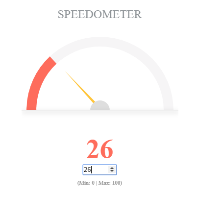

# Speedometer
 An interactive angular 6 based component which shows the speedometer reading based on data provided. It can further be implemented with back-end response too.
  


## Demo
You may want to have a look at the demo https://speedometer.stackblitz.io

## Adding the component in your project
Download speedo-meter component and include it in your project
```
<speedo-meter-app></speedo-meter-app>
```

### speedo-meter.component.ts
```typescript
export class SpeedoMeterComponent {
  private speedScore:number = 0; //min : 0; max: 100
  private readingSpeed:number;
  private niddleSpeed:number;
  constructor() { }

  updateSpeed(){
    this.readingSpeed = Math.round(this.speedScore * 180/100)-45;
    this.niddleSpeed = Math.round(this.speedScore * 180/100)-90;
  }

  getSpeed(speed){
    this.speedScore = speed;
    this.updateSpeed();
  }
  ```
  * speedscore        :   The value entered by user (You may want to get it as response data from JSON)
  * readingSpeed      :   The value of orange colured curve bar; depends on the calculation based on speedScore value
  * niddleSpeed       :   The value of ratation angle of niddle; depends on the calculation based on speedScore value
  
  ### speedo-meter.component.html
  ``` typescript
  <style>
@keyframes movement {
    from {
      transform: rotate(-45deg);
    }
    to {
      transform: rotate('{{readingSpeed}}' + deg);
    }
  }

  @keyframes niddle {
    from {
      transform: rotate(-90deg);
    }
    to {
      transform: rotate('{{niddleSpeed}}'+ deg);
    }
  }
</style>

  
<div class="speedometerWrap">
  <h1>Speedometer</h1>
  <div class="speedometer">
    <div class="speedometerReading" 
      [style.transform]="'rotate(' + readingSpeed  + 'deg)'">
    </div>
    <div class="speedometerReadingBase"></div>
    <div class="speedometerCentreCircle">
      <span [style.transform]="'rotate(' + niddleSpeed  + 'deg)'"></span>
    </div> 
    <div class="speedometerBase"></div>   
  </div>
  <div class="meterRead">
    <div class="meterValue">{{ speedScore }}</div>
    <input type="number" min='0' max='100' [(ngModel)]='speedScore' class="form-control" (keyup)="getSpeed(speedScore)" (click)="getSpeed(speedScore)">
    <br/>
    <span class="range">(Min: 0 | Max: 100)</span>
  </div>    
</div>


  ```

